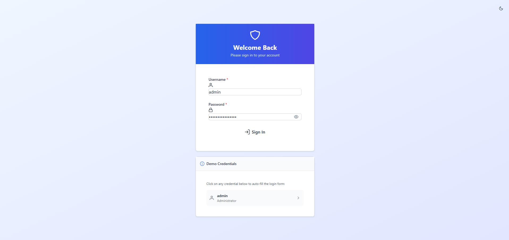
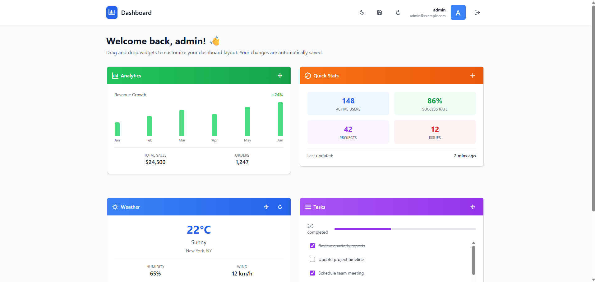
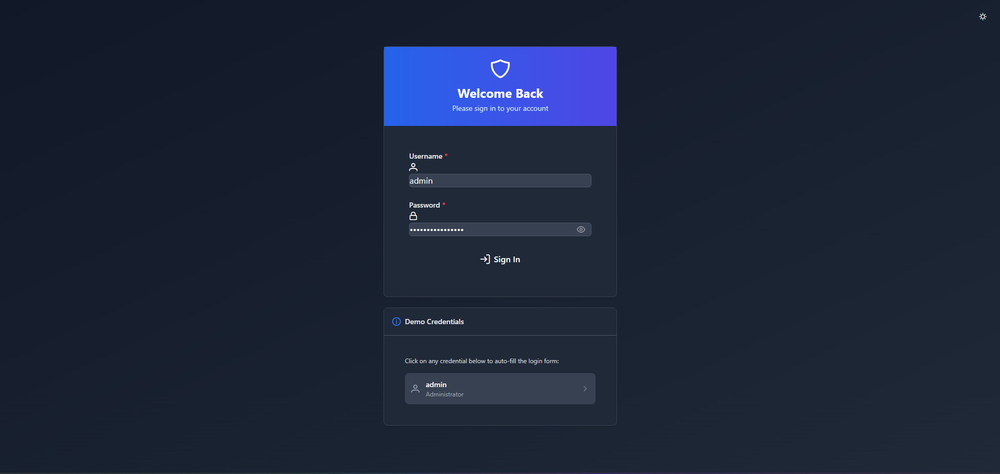
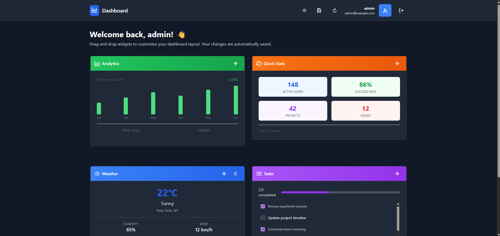

# Angular 19 Dashboard – Zoneless, Signals-Driven 🚀

A modern dashboard application built with Angular 19, PrimeNG, and Tailwind CSS. The app runs **completely zone-free** and leverages **Angular Signals** for state management, delivering exceptional performance with a minimal bundle size.

## Requirements

- Node.js 20 (LTS) or higher
- npm 10 (or pnpm / yarn)
- Angular CLI 19.x

## Installation & Running

```bash
# install dependencies
npm install

# start a local dev server at http://localhost:4200
npm start   # →  ng serve
```

### Additional scripts

```bash
npm run build      # production build (ng build --configuration production)
npm run test       # unit tests with Karma + Jasmine
npm run watch      # incremental dev build
```

## Key Features

1. **Zone-Free Change Detection** – Bootstrapped with `provideExperimentalZonelessChangeDetection()`; Zone.js has been removed from dependencies.
2. **Signals-Based State** – `signal()`, `computed()`, and `effect()` drive the entire application state (widgets, authentication, theming, etc.).
3. **PrimeNG + Tailwind UI** – Combines PrimeNG components with Tailwind CSS utility classes for rapid, theme-able styling.
4. **Drag-and-Drop Dashboard** – Widgets (Weather, Chart, Tasks, Stats) can be repositioned via drag & drop; layouts are persisted per-user in `localStorage`.
5. **Auto-Save & Versioned Layouts** – Widget positions automatically debounce-save; versioning guards against incompatible layouts.
6. **Dark / Light Theme Toggle** – Instant theme switching powered by Signals and PrimeNG's dynamic theming API.
7. **Weather Auto-Refresh** – Weather widget refreshes mock data every 5 minutes (and on-demand).
8. **Authentication Demo** – Simple signal-based auth service with demo credentials (`admin / Test!2025$Unique`).

## Drag-and-Drop&nbsp;+&nbsp;Layout Persistence

The dashboard grid is fully interactive—every widget can be picked up and moved to any of the four available slots. Under the hood, the **`WidgetStorageService`** handles persistence with the following flow:

1. Each widget has a `(row, col)` position stored in a `signal<Widget[]>`.
2. When a widget is dropped, the service **debounces** the update for 1&nbsp;second to avoid excessive writes.
3. The entire layout is serialized to JSON and saved under the key **`dashboard_widget_layout`** in `localStorage`, together with a `userId`, `version`, and `lastUpdated` timestamp.
4. On application start (or user login) the service:
   - Reads the stored layout for the current user.
   - Validates version compatibility and falls back to a default layout if necessary.
   - Hydrates the widget `signal` so the UI instantly reflects the saved positions.

This means your custom layout survives page reloads, browser restarts, and even network-less scenarios—while remaining per-user and forward-compatible thanks to the version field.

## Project Structure (relevant)

```
src/
 ├─ app/
 │  ├─ components/          # shared UI pieces (e.g. theme toggle)
 │  ├─ dashboard/           # main dashboard view
 │  ├─ login/               # login page
 │  ├─ services/            # signal-based services (auth, theme, widgets)
 │  └─ widgets/             # standalone widget components
 ├─ main.ts                 # zone-free bootstrap
 └─ app.config.ts           # global providers
```

## Technology Stack

- **Angular 19.2** (standalone APIs, Signals, functional guards)
- **PrimeNG 19** & **PrimeIcons 7** – component library
- **Tailwind CSS 3** – utility-first styling
- **RxJS 7** – kept only for legacy convenience (e.g. optional *loginRx*)
- **TypeScript 5.7**

## Deploying

Run a production build and serve the contents of `dist/` with any static web server:

```bash
npm run build
npx http-server dist/test-case --port 5000
```

## Screenshots

> A quick visual tour of the application in both light and dark themes.

| Login | Dashboard |
|-------|-----------|
|  |  |
|  |  |

---

## Author

**Philip Ramkeerat**  
 [philipramkeerat.com.br](https://philipramkeerat.com.br/home)  
 [philip_ramkeerat@hotmail.com](mailto:philip_ramkeerat@hotmail.com)

---


